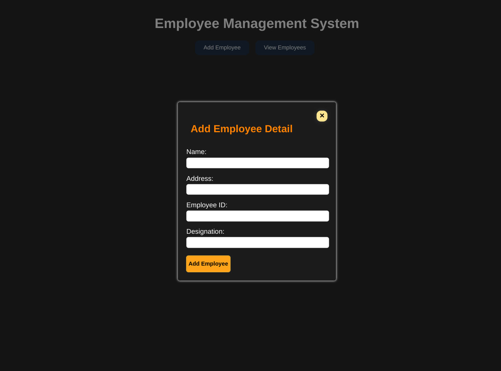
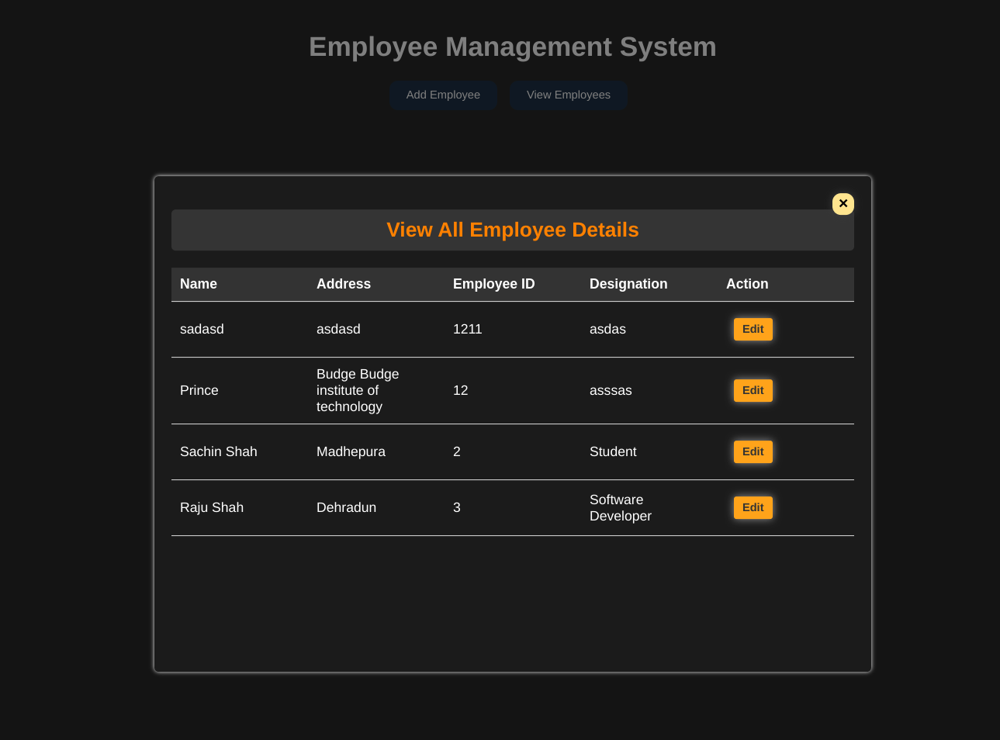

# Employee Management System

## 🚀 Functionality:

1. **Add Employee**: Users can input details such as name, address, employee ID, and designation to add a new employee to the system.

2. **Edit Employee**: Users can edit existing employee details, including their name, address, employee ID, and designation.

3. **View Employees**: Users can view a list of all employees currently stored in the system, along with their respective details.

4. **Error Handling**: The system includes error handling to ensure that all required fields are filled out when adding or editing an employee. It also checks for duplicate employee IDs to maintain data integrity.

5. **User Interface**: The system features a user-friendly interface with popups for adding and editing employees, making it easy for users to interact with the application.

## 💻 Home Page

## 🔑 Key Points:

1. **HTML/CSS/JavaScript**: The system is built using HTML for structure, CSS for styling, and JavaScript for functionality. This combination allows for a dynamic and responsive user experience.

2. **Object-Oriented Programming**: The system utilizes object-oriented programming principles, such as classes and constructors, to create and manage employee objects.

3. **Event Handling**: Event handling is used to capture user interactions, such as clicking buttons to add or edit employees, and to perform the appropriate actions in response to those interactions.

4. **Data Validation**: The system validates user input to ensure that all required fields are filled out and that the data entered is valid. This helps prevent errors and maintain data integrity.

5. **Modularity**: The code is organized into separate functions and modules, making it easy to understand and maintain. This modular approach improves code readability and reusability.

## 👥 User list Dashboard 

